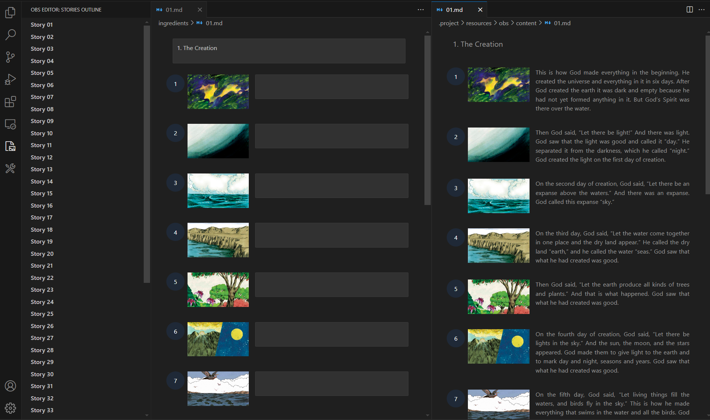
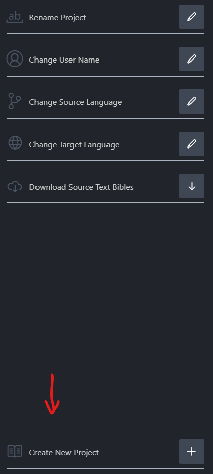
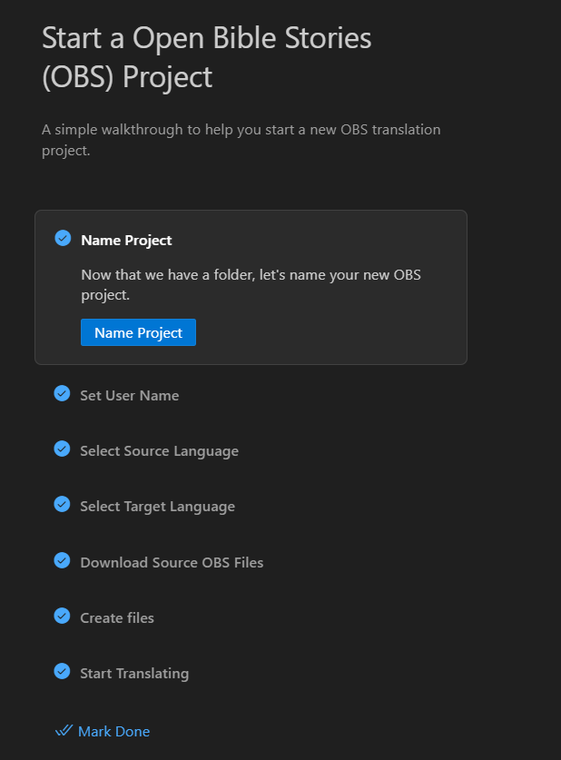
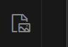

# OBS Extension

This is a VSCode Extension for viewing and editing Open Bible Stories (OBS). This extension uses a custom editor 



## Documentation

For a deeper dive into how this sample works, read the guides below.

- [Extension structure](./docs/extension-structure.md)
- [Extension commands](./docs/extension-commands.md)
- [Extension development cycle](./docs/extension-development-cycle.md)

## Run The Sample

Follow the following steps to see the translation notes extension in action. Replace the `npm` with any package manager of your choice. The extension was developed with the `pnpm` package manager, so scripts in the `package.json` file will favor pnpm.

1. Clone the repository:

   ```bash
   git clone https://github.com/kintsoogi/translation-notes-extension.git
   ```

2. Install dependencies for both the extension and webview (Use the package manager of your choice. If you use pnpm, you can just run `pnpm install:all` in the root directory).

   a. Install root directory dependencies

   ```bash
   npm install
   ```

   b. Move to the `webview-ui` directory and install dependencies

   ```bash
   npm install
   ```

3. Build the webview so that it renders on extension run

   a. If in the root directory, run:

   ```bash
   npm build:webview
   ```

   b. If in the `webview-ui` directory, run:

   ```bash
   npm run build
   ```

4. Open vscode editor (using `code .` in the current directory or using the UI)

5. Press `F5` to open a new Extension Development Host window

6. Open a folder where you would like to create your OBS Translation Project

7. If you do not see the walkthrough, click on the Project manager sidebar and click "Create New Project"

   >  > 

8. Follow all steps of the walkthrough (especially initialize/download OBS steps)

   > 

9. Click Start Translating to see the side-by-side OBS view! Alternatively, click the OBS Editor Sidebar.
   > 
